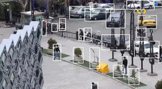

# Object tracking with Deep-SORT and YOLOv7

We developed a tracking package using DeepSORT and YOLOv7. YOLOv7 is a deep neural network model which is used to detect objects in every frame. DeepSORT based on Kalman filter and Hungerian algorithm predicts the position of each object in the next frame using detetions of the current and previous frames. It also deploys person ReID model to better distinguish persons in the video.

There are three examples of this package below.





## Training

### Detection model training

You can train teh detection model in [YOLOv7](https://github.com/WongKinYiu/yolov7) repository.

### Tracking model Training

Cosine Metric Learning model weigts is needed for DeepSORT tracking. Cosine metric learning is used for Person ReID. Refer to [
cosine_metric_learning](https://github.com/nwojke/cosine_metric_learning) for training.

## Pretrained models

### Detection

You can download pretrained weights of the detection model using the links bellow. Refer to [YOLOv7](https://github.com/WongKinYiu/yolov7) repository to figure out the differences between the models bellow.

| Model | Frame Size |
| :-- | :-: |
| [**YOLOv7**](https://github.com/WongKinYiu/yolov7/releases/download/v0.1/yolov7.pt) | 640 |
| [**YOLOv7-X**](https://github.com/WongKinYiu/yolov7/releases/download/v0.1/yolov7x.pt) | 640 |
|  |  |
| [**YOLOv7-W6**](https://github.com/WongKinYiu/yolov7/releases/download/v0.1/yolov7-w6.pt) | 1280 |
| [**YOLOv7-E6**](https://github.com/WongKinYiu/yolov7/releases/download/v0.1/yolov7-e6.pt) | 1280 |
| [**YOLOv7-D6**](https://github.com/WongKinYiu/yolov7/releases/download/v0.1/yolov7-d6.pt) | 1280 |
| [**YOLOv7-E6E**](https://github.com/WongKinYiu/yolov7/releases/download/v0.1/yolov7-e6e.pt) | 1280 |

### Tracking

You can download pretrained weights of cosine metric learning model [here](https://drive.google.com/open?id=13HtkxD6ggcrGJLWaUcqgXl2UO6-p4PK0). The format of the file is protobuf (.pb).

## Installations

At first, you should install torch, torchvision and tensorflow libraries compatible with your device, cuda version or cpu.

Install `requirements.txt`.
Then install `torch>=1.8.1,<=1.13.1` and `torchvision>=0.9.1,<=0.14.1`.
and install `tensorflow==2.4.4` or `tensorflow-gpu==2.4.4` accourding to your configurations.

Example:

```bash
pip install requirements.txt
pip install torch==1.9.0+cu111 torchvision==0.10.0+cu111 torchaudio==0.9.0 -f https://download.pytorch.org/whl/torch_stable.html
pip install tensorflow-gpu==2.4.4
```

## Deploy

Get the detection model and cosine metric model which you trained or download pretrained models.

Set input parameters in configs.yaml file.
`Input_size` parameter must be relative to the detection model config. Refer to Training part and Pretrained models part for more information.

Then run the command below.

```bash
python main.py
```
